# ConfPresence ZERO — Enterprise High-Level Design (HLD) Document
**Zero-Hardware Dual-Sensor Presence Engine (BLE + Wi-Fi)**

---

## 1. Document Control

| Property | Value |
|---|---|
| **Document Title** | High-Level Design (HLD) Document — ConfPresence ZERO |
| **Project Name** | ConfPresence ZERO |
| **Document Version** | 1.0.0 |
| **Document Status** | Approved for Technical & Architectural Review |
| **Author** | Principal Systems Architect & Mobile/Cloud Engineering Lead |
| **Date** | August 2026 |
| **Target Audience** | Engineering Managers, Solution Architects, Technical Leads, Senior Software Engineers |

### Revision History

| Version | Date | Author | Description of Changes |
|---|---|---|---|
| `0.1.0` | August 14, 2026 | Core Engineering Team | Initial 4-Day Android-first BLE mesh proof-of-concept scope and native bridge design. |
| `0.2.0` | August 18, 2026 | Mobile & Backend Leads | Integrated dual-sensor ambient Wi-Fi AP fingerprinting and normalized cosine similarity inference. |
| `0.3.0` | August 21, 2026 | Systems Architect | Implemented optimistic presenter hosting, server network diagnostics, and 16-byte token resolution hardening. |
| `1.0.0` | August 24, 2026 | Principal Architect | Complete Enterprise High-Level Design (HLD), multi-modal sensor fusion analysis, gap audit, and 5-phase production roadmap. |

---

## 2. Executive Summary

**ConfPresence ZERO** is a software-driven, privacy-preserving, zero-hardware presence verification and room-level proximity clustering platform designed for conferences, breakout workshops, and enterprise venues. It addresses the multi-million dollar operational and financial overhead of physical attendance verification—traditionally requiring thousands of dedicated hardware Bluetooth beacons, optical doorway scanners, RFID badges, or manual paper rosters—by utilizing the smartphones already carried by attendees and presenters.

```
┌────────────────────────────────────────────────────────────────────────────────────────┐
│                               ConfPresence ZERO Ecosystem                              │
├──────────────────────────────┬─────────────────────────────┬───────────────────────────┤
│ In-Room Physical Layer       │ Mobile Mesh Layer           │ Cloud Inference Layer     │
│ • Presenter Anchor Phone     │ • BLE Advertising (0x7A04)  │ • Graph Adjacency Engine  │
│ • Attendee Phones            │ • Background/FG BLE Scan    │ • Wi-Fi Cosine Similarity │
│ • Ambient Wi-Fi Access Points│ • Wi-Fi AP BSSID/RSSI Vector│ • Dual-Sensor Fusion      │
└──────────────────────────────┴─────────────────────────────┴───────────────────────────┘
```

### Problem Addressed
Verifying attendee presence for room occupancy tracking, Continuing Professional Development (CPD/CEU) compliance, and crowd dynamics currently incurs massive logistics costs ($5,000–$50,000+ per venue) in hardware deployment, maintenance, gateway battery replacements, and optical line-of-sight bottlenecks.

### The Zero-Hardware Approach
ConfPresence ZERO transforms commodity mobile devices into a collaborative peer-to-peer spatial sensing mesh. Presenters act as spatial anchors for specific rooms, while attendee devices exchange ephemeral Bluetooth Low Energy (BLE) rotating pseudonyms and capture ambient 2.4 GHz / 5 GHz Wi-Fi Access Point (AP) radio signatures. The backend aggregates these sparse observations into an adjacency graph, applying graph connected-component traversal and vector cosine similarity to mathematically estimate in-room presence without requiring dedicated venue hardware.

### Current POC State
The current codebase is a functional **Dual-Sensor Proof of Concept (POC)** built as a TypeScript monorepo (`pnpm` workspaces):
- **Mobile Client (`apps/mobile`):** React Native 0.81.5 / Expo 54 with custom native modules for Android (Kotlin: `ConfPresenceBleModule.kt`, `ConfPresenceWifiModule.kt`) and preliminary iOS native bridges (Swift/Obj-C: `ConfPresenceBleModule.swift`, `ConfPresenceWifiModule.swift`).
- **Backend API (`apps/api`):** Node.js / Express 5.1.0 with runtime Zod schema validation and a stateful in-memory inference engine (`PocInferenceEngine`).
- **Shared Contracts (`packages/shared`):** Common domain models and data transfer objects (DTOs).
- **Core Algorithms:** Rotating 60-second pseudonymous tokens, 30-second sliding-window observation buffering, undirected BFS graph clustering (RSSI $\ge -85\text{ dBm}$), and vector cosine similarity scoring of ambient Wi-Fi BSSID/RSSI pairs.

### Target Enterprise Evolution
While the current POC demonstrates high-confidence dual-sensor clustering in local test environments, enterprise production deployment requires transitioning from single-node in-memory storage to a distributed event-driven cloud architecture (Redis real-time caching, PostgreSQL/TimescaleDB audit persistence, containerized API microservices, background job schedulers, HMAC cryptographic token signing, and comprehensive observability).

---

## 3. Business and Technical Problem Statement

### 3.1 The Enterprise Problem
Professional conferences, corporate summits, and academic symposia require reliable room-level attendance tracking for:
1. **Accreditation & Compliance:** Awarding Continuing Education Units (CEU) and Continuing Professional Development (CPD) credits requires verifiable proof of physical dwell time in specific sessions.
2. **Room Capacity & Safety:** Monitoring real-time crowd density and venue safety compliance.
3. **Session Popularity & Analytics:** Providing organizers and sponsors with granular audience engagement metrics.

### 3.2 Inherent Flaws of Existing Hardware Approaches

```
Existing Approaches vs. ConfPresence ZERO:
┌─────────────────────────┬──────────────────────────────────┬─────────────────────────────┐
│ Tracking Method         │ Core Failure Modes               │ Cost & Complexity           │
├─────────────────────────┼──────────────────────────────────┼─────────────────────────────┤
│ Fixed Wall Beacons      │ Battery depletion, dead zones,   │ High hardware costs, venue  │
│ (iBeacon / Eddystone)   │ signal bleed through drywall     │ installation permits        │
├─────────────────────────┼──────────────────────────────────┼─────────────────────────────┤
│ Optical Barcode/RFID    │ Long doorway queues, manual scan │ Heavy staffing costs, slow  │
│ Badges & Turnstiles     │ friction, badge hand-offs/fraud  │ entry throughput            │
├─────────────────────────┼──────────────────────────────────┼─────────────────────────────┤
│ GPS / Cellular Geofence │ Ineffective indoors, floor-level │ Fails multi-story buildings,│
│                         │ ambiguity, severe privacy drain  │ excessive battery usage     │
├─────────────────────────┼──────────────────────────────────┼─────────────────────────────┤
│ ConfPresence ZERO       │ None (utilizes existing attendee │ Zero hardware, zero staff,  │
│ (Software Mesh)         │ & presenter mobile devices)      │ high privacy & accuracy     │
└─────────────────────────┴──────────────────────────────────┴─────────────────────────────┘
```

### 3.3 The Software/Mobile-First Value Proposition
- **Zero Capex / Opex Hardware Costs:** Eliminates physical gateways, beacon maintenance, battery audits, and gate scanner rentals.
- **Natural Boundary Grounding:** Presenters serve as ground-truth session anchors. An attendee cannot be clustered into "Room A" unless their device exhibits peer proximity edges linking them to the presenter's anchor phone.
- **Multi-Sensor Integrity:** Combining short-range BLE radio observations with structural Wi-Fi AP signal vectors prevents false positives caused by radio penetration through walls.
- **Privacy-First Design:** Operates without tracking GPS, without capturing MAC addresses, without recording audio, and without persisting persistent device identifiers across sessions.

---

## 4. Goals and Objectives

### 4.1 Functional Objectives

| Objective | Status | Implementation Details / Target Expectation |
|---|---|---|
| **Role-Based Partitioning** | **Currently Implemented** | Support for `presenter` (spatial anchor) and `attendee` roles. |
| **Pseudonymous Token Rotation** | **Currently Implemented** | Rotating 60-second ephemeral tokens derived from device pseudonym and epoch time. |
| **Foreground BLE Mesh** | **Currently Implemented** | Native Android BLE advertising and scanning under 16-bit Service UUID `0x7A04`. |
| **Ambient Wi-Fi Fingerprinting** | **Currently Implemented (Android)** | Captures visible BSSIDs and RSSI levels on Android (top 15 APs); mapped via Cosine Similarity. |
| **Graph-Based Presence Inference** | **Currently Implemented** | Single/multi-hop BFS connected-component clustering anchored to presenter device ID. |
| **Dual-Sensor Confidence Scoring** | **Currently Implemented** | Sensor fusion engine outputting confidence scores ($0.70 - 0.98$) and Wi-Fi match percentages. |
| **Live UI Presence Roster** | **Currently Implemented** | Real-time participant roster showing confirmed attendees, roles, confidence, and signal type. |
| **Presenter Dynamic Room Management** | **Currently Implemented** | Presenters can select or dynamically instantiate new room anchors (`room-a`, `room-b`, etc.). |
| **Local Server Discovery** | **Currently Implemented** | Client-side automatic network probing to discover backend server on local subnets. |
| **Background BLE & Push Wake** | **Proposed / Target State** | Silent push notifications (APNs/FCM) and Android Foreground Services for background operation. |
| **Multi-Room Concurrent Labeling** | **Partially Implemented** | Multi-room graph partitioning across multiple simultaneous presenter anchors. |
| **Automated CPD Attendance Certificates**| **Proposed / Target State** | Ingestion pipeline computing dwell-time integrals and emitting tamper-proof audit certificates. |

### 4.2 Non-Functional Objectives

| Objective | Category | Evaluation & Architectural Target |
|---|---|---|
| **Privacy & Anonymity** | **Achieved (POC) / Target (Prod)** | **Current:** Ephemeral random IDs (`android-xxx`), no Bluetooth MAC collection, no audio recording.<br>**Target:** Zero-Knowledge Proofs / HMAC rotating tokens signed with venue master key. |
| **Low Latency Presence Update** | **Achieved (POC)** | End-to-end latency from peer observation to UI dashboard display is $\le 10$ seconds (10s batch cycle, 3s poll). |
| **Cross-Platform Compatibility** | **Partially Implemented** | Android fully functional with native Kotlin bridges. iOS native Swift/Obj-C modules authored but require development builds and entitlement validation. |
| **Scalability & Ingestion Volume**| **Target / Enterprise State** | **Current:** In-memory storage suitable for $\le 50$ devices.<br>**Target:** Stateless horizontal API microservices backed by Redis Cluster and Kafka/RabbitMQ handling 10,000+ concurrent devices. |
| **Reliability & Fault Tolerance** | **Target / Enterprise State** | Resilient against mobile OS process termination, network packet drops, and temporary server disconnects. |
| **Security & Transport Integrity**| **Target / Enterprise State** | TLS 1.3 encryption, API bearer token authentication, request rate limiting, and cryptographic observation replay protection. |

---

## 5. Scope

### 5.1 In Scope (Current Implementation)
- TypeScript Monorepo architecture managed via `pnpm` workspaces (`@confpresence/shared`, `@confpresence/api`, `@confpresence/mobile`).
- Custom Android Kotlin Native Module (`ConfPresenceBleModule.kt`) providing low-level BLE advertising (`ADVERTISE_MODE_LOW_LATENCY`, `TX_POWER_HIGH`) and continuous scanning (`SCAN_MODE_LOW_LATENCY`).
- Custom Android Kotlin Wi-Fi Module (`ConfPresenceWifiModule.kt`) capturing ambient BSSID, SSID, RSSI, and frequency with 30-second scan throttling protection.
- Client-side `PresenceService` managing 10-second observation batching, 60-second epoch token rotation, and asynchronous REST synchronization.
- Node.js / Express 5.1.0 backend with Zod schema validation, sliding-window observation buffering (30 seconds), and BFS graph clustering.
- Normalized vector Cosine Similarity engine computing Wi-Fi fingerprint alignment and dual-sensor confidence fusion.
- React Native mobile user interface with live participant tables, optimistic presenter hosting, server diagnostics, and room management.
- Standalone iOS native module files (`ConfPresenceBleModule.swift`, `ConfPresenceWifiModule.swift`) for BLE peripheral/central management and Wi-Fi interface probing.
- Production containerization baseline via root `Dockerfile` and `render.yaml`.

### 5.2 Out of Scope (Current POC)
- Acoustic/ultrasound (18–20 kHz) near-field gating.
- Hardware Bluetooth beacons, optical scanners, or fixed RFID gateways.
- Apple App Store and Google Play Store production distribution.
- Multi-tenant enterprise RBAC, OAuth2/OIDC user identity providers, and persistent SQL database schemas.
- Machine Learning (ML) fingerprint clustering or neural RSSI calibration models.
- Legal/regulatory audit-grade CPD attendance certification exports.

### 5.3 Assumptions
1. **Device Density:** At least 2 physical mobile devices participate in a session, with 1 device designated as the presenter (anchor).
2. **Radio Hardware:** Android devices possess BLE peripheral (advertising) and central (scanning) hardware support.
3. **Venue Wi-Fi:** Ambient Wi-Fi Access Points are present and broadcasting observable beacon frames.
4. **App State:** The mobile application remains in the foreground during the active session for the duration of the POC evaluation.

### 5.4 Constraints
1. **Android Wi-Fi Throttling:** Android 9+ (API 28+) enforces Wi-Fi scan throttling (foreground apps restricted to 4 scans per 2-minute window).
2. **iOS Platform Restrictions:** iOS strictly prohibits ambient Wi-Fi scanning on standard non-MDM devices (`NEHotspotNetwork` only returns the single currently connected SSID/BSSID and requires special Apple entitlements). iOS background BLE advertising is also heavily restricted.
3. **In-Memory Volatility:** The current backend inference engine stores all active devices, tokens, and batches in Node.js process heap memory; any server restart purges active room states.

---

## 6. Current System Overview

The current system architecture consists of a mobile client tier communicating over a local IP network with a centralized Node.js API server.

### 6.1 System Context Diagram (Current State)

```mermaid
flowchart TD
    subgraph VenuePhysicalSpace ["Physical Conference Room"]
        PresenterDevice["Presenter Mobile Device\n(Spatial Anchor)"]
        AttendeeDeviceA["Attendee Device A\n(Mobile Mesh Node)"]
        AttendeeDeviceB["Attendee Device B\n(Mobile Mesh Node)"]
        WifiAP["Ambient Venue Wi-Fi APs\n(2.4 GHz / 5 GHz Beacons)"]
    end

    subgraph MobileAppLayer ["Mobile Client Runtime (React Native / Native)"]
        BleRadio["BLE Subsystem\n(Adv: 0x7A04 / Scan)"]
        WifiSubsystem["Wi-Fi Subsystem\n(BSSID Scan Results)"]
        PresService["PresenceService\n(10s Batching / 60s Token)"]
        AppUI["Mobile Dashboard UI\n(App.tsx / Live Roster)"]
    end

    subgraph BackendLayer ["Backend Processing Tier (apps/api)"]
        ExpressServer["Express 5.1 REST API\n(Port 3000 / Zod Validation)"]
        InferenceEngine["PocInferenceEngine\n(In-Memory Sliding Window)"]
        GraphClusterer["Graph Clustering &\nCosine Similarity Engine"]
    end

    PresenterDevice <-->|BLE Advertisements\nService UUID 0x7A04| AttendeeDeviceA
    AttendeeDeviceA <-->|BLE Advertisements\nService UUID 0x7A04| AttendeeDeviceB
    WifiAP -.->|Passive RF Beacons| PresenterDevice
    WifiAP -.->|Passive RF Beacons| AttendeeDeviceA
    WifiAP -.->|Passive RF Beacons| AttendeeDeviceB

    PresenterDevice --> BleRadio & WifiSubsystem
    AttendeeDeviceA --> BleRadio & WifiSubsystem
    
    BleRadio --> PresService
    WifiSubsystem --> PresService
    PresService --> AppUI
    
    PresService -->|HTTP POST /api/observations\n(JSON Batch Payload)| ExpressServer
    AppUI -->|HTTP GET /api/rooms/:roomId/live\n(3s Polling Interval)| ExpressServer
    
    ExpressServer --> InferenceEngine
    InferenceEngine --> GraphClusterer
```

### 6.2 Component Responsibility & Interface Summary

| Component | Repository Path | Responsibility | Inputs | Outputs | Communication |
|---|---|---|---|---|---|
| **Shared Contracts** | `packages/shared` | Canonical TypeScript interfaces and domain types. | N/A | TypeScript AST / DTO definitions | Internal compile-time dependency |
| **Mobile UI** | `apps/mobile/App.tsx` | User controls, role toggle, room management, server discovery, and live roster table. | User touch events, polling data | Rendered JSX view state | React Native state updates |
| **Presence Service** | `apps/mobile/src/services/presenceService.ts` | Orchestrates token rotation, observation buffering, batch compilation, and API dispatch. | Native BLE/Wi-Fi events, config | Structured HTTP batches | NativeEventEmitter, `fetch` API |
| **Device Identity** | `apps/mobile/src/services/deviceIdentity.ts` | Generates persistent pseudonym and 60-second epoch rotating token. | OS platform type, timestamp | Formatted token strings | In-memory function invocation |
| **Android BLE Module** | `ConfPresenceBleModule.kt` | Direct Android hardware interface for BLE advertising and scanning. | Start/stop commands, rotating token | `ConfPresencePeerDetected` events | React Native JNI bridge |
| **Android Wi-Fi Module**| `ConfPresenceWifiModule.kt` | Queries Android `WifiManager` for top 15 visible AP BSSIDs, SSIDs, and RSSI levels. | Trigger commands | `WritableArray` of AP objects | React Native Promise bridge |
| **REST API Server** | `apps/api/src/index.ts` | HTTP routing, CORS middleware, and Zod runtime schema validation. | Inbound HTTP JSON requests | HTTP status codes, JSON responses | Express HTTP / JSON |
| **Inference Engine** | `apps/api/src/inference.ts` | In-memory sliding-window buffer, graph adjacency builder, BFS clusterer, and Wi-Fi cosine scorer. | Validated batches, query params | `LiveRoomState` DTOs | In-memory method execution |

---

## 7. Detailed High-Level Architecture

The system utilizes an asynchronous ingestion and query-decoupled architecture. Mobile devices independently generate observations and stream them to the ingestion endpoint, while the UI periodically queries the computed room projection.

### 7.1 Verified Current Architecture Diagram

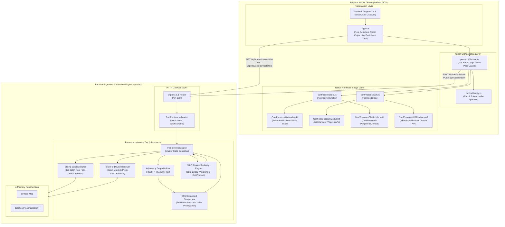

---

## 8. Mobile Application Architecture

### 8.1 Application Layout & Directory Structure
The mobile client (`apps/mobile`) is built on React Native 0.81.5 and Expo 54:
- `App.tsx`: Top-level application component holding master UI state, optimistic rendering, and polling timers.
- `src/services/deviceIdentity.ts`: Pseudonym management and token generation.
- `src/services/presenceService.ts`: Core lifecycle controller managing background loops, native module binding, and HTTP communication.
- `src/native/confPresenceBle.ts`: TypeScript interface and `NativeEventEmitter` wrapper for BLE events.
- `src/native/confPresenceWifi.ts`: TypeScript interface and Promise bridge for Wi-Fi scanning.
- `android/app/src/main/java/com/confpresence/zero/ble/ConfPresenceBleModule.kt`: Android Kotlin BLE bridge.
- `android/app/src/main/java/com/confpresence/zero/wifi/ConfPresenceWifiModule.kt`: Android Kotlin Wi-Fi bridge.
- `ios/ConfPresenceBleModule.swift` & `ios/ConfPresenceWifiModule.swift`: iOS native module implementations.

### 8.2 Mobile Component Hierarchy Diagram

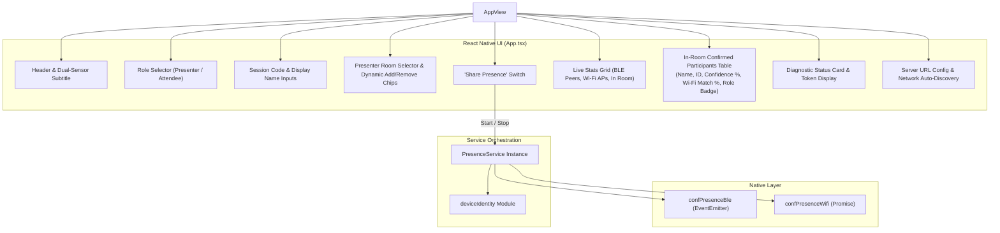

### 8.3 Device Identity & Rotating Pseudonym Generation
To balance privacy protection with graph edge resolution:
1. **Permanent Pseudonym:** When the app initializes, `getOrCreateDeviceId()` generates an ephemeral device ID formatted as `${Platform.OS}-${random10CharString}` (e.g., `android-9k2f81m4qa`).
2. **Rotating Ephemeral Token:** Every 60 seconds (`epochMs = 60_000`), `createRotatingId()` computes:
   $$\text{epoch} = \lfloor \text{Date.now()} / 60000 \rfloor$$
   $$\text{prefix} = \text{deviceId.slice}(-8).\text{padStart}(8, \text{"0"})$$
   $$\text{epochStr} = \text{epoch.toString}(36).\text{slice}(-6).\text{padStart}(6, \text{"0"})$$
   $$\text{rotatingId} = \text{prefix} + \text{"-"} + \text{epochStr}$$
   *Example Token:* `9k2f81m4-00x9lm` (15 characters, perfectly fitting into the 16-byte BLE service data buffer).

### 8.4 Observation Collection & Batching Loop
The `PresenceService` maintains two in-memory caches:
- `peers: Map<string, NativePeer>`: Collects raw sightings within the current 10-second batch interval.
- `activePeerCache: Map<string, { peer: NativePeer; lastSeenAt: number }>`: A 30-second sliding-window cache used to prevent UI peer count flickering between batch dispatches.

Every 10 seconds (`BATCH_INTERVAL_MS = 10_000`), `flushAndRotate()` executes:
1. Gathers ambient Wi-Fi APs via `getWifiFingerprint()`.
2. Packages the current batch:
   ```json
   {
     "sessionId": "poc-session",
     "deviceId": "android-9k2f81m4qa",
     "displayName": "Dr. Alice",
     "rotatingId": "9k2f81m4-00x9lm",
     "role": "presenter",
     "roomId": "room-a",
     "capturedAt": "2026-08-24T15:30:00.000Z",
     "motionState": "unknown",
     "peers": [
       { "rotatingId": "8b1a4c9e-00x9lm", "rssi": -68, "seenAt": "2026-08-24T15:29:58.120Z" }
     ],
     "wifiFingerprint": [
       { "bssid": "aa:bb:cc:01:01:01", "ssid": "Venue-5G", "rssi": -52, "frequency": 5180 }
     ]
   }
   ```
3. Dispatches the HTTP POST request to `/api/observations`.
4. Triggers token rotation and re-arms the native BLE advertiser with the new token.

### 8.5 Android Native Implementation Details
The Kotlin native module (`ConfPresenceBleModule.kt`) manages Android Bluetooth Low Energy:
- **Service UUID:** `00007a04-0000-1000-8000-00805f9b34fb` (16-bit short form: `0x7A04`).
- **Advertising Configuration:**
  - `AdvertiseMode: ADVERTISE_MODE_LOW_LATENCY` (~100ms advertising interval).
  - `TxPowerLevel: ADVERTISE_TX_POWER_HIGH` (maximum signal reach for peer discovery).
  - `Connectable: false` (pure broadcast beacon; no GATT connection overhead).
  - Payload buffer: Exact 16-byte array copy (`StandardCharsets.UTF_8`).
- **Scanning Configuration:**
  - `ScanMode: SCAN_MODE_LOW_LATENCY` (continuous duty scanning).
  - `ReportDelay: 0` (immediate per-packet callback invocation).
- **3-Tier Packet Decoding:**
  1. Direct extraction via `ScanRecord.getServiceData(SERVICE_UUID)`.
  2. Iteration across all service data keys matching short UUID `7A04`.
  3. Raw byte parsing searching for AD structure type `0x16` (16-bit Service Data) with bytes `0x04, 0x7A` or `0x7A, 0x04`.

### 8.6 Current iOS Status and Platform Limitations
The repository contains native Swift implementations (`ConfPresenceBleModule.swift` and `ConfPresenceWifiModule.swift`):
- **BLE Advertising:** Uses `CBPeripheralManager` advertising `CBAdvertisementDataServiceUUIDsKey` and `CBAdvertisementDataLocalNameKey`.
- **BLE Scanning:** Uses `CBCentralManager` scanning for service `7A04` with `CBCentralManagerScanOptionAllowDuplicatesKey: true`.
- **iOS Wi-Fi Limitations:** iOS strictly prohibits ambient Wi-Fi scanning. `NEHotspotNetwork.fetchCurrent` only returns the SSID and BSSID of the network the device is *actively connected to* (requiring the `com.apple.developer.networking.wifi-info` entitlement). Scanning multiple unassociated ambient APs is impossible on standard iOS.

---

## 9. BLE Presence Architecture

### 9.1 Step-by-Step BLE Execution Lifecycle

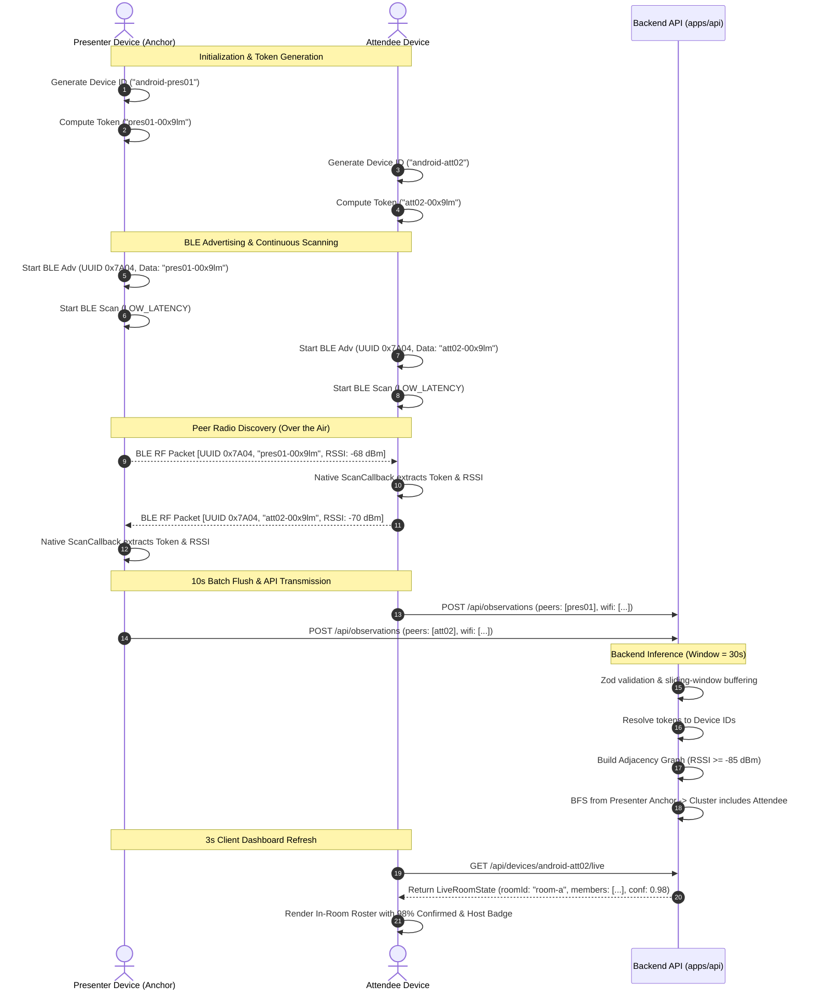

### 9.2 Configured BLE Parameters and Thresholds

| Parameter | Configured Value | Source File | Architectural Purpose |
|---|---|---|---|
| **Service UUID** | `00007a04-0000-1000-8000-00805f9b34fb` | `ConfPresenceBleModule.kt:30` | Dedicated 16-bit short UUID (`0x7A04`) for ConfPresence beacons. |
| **Manufacturer ID** | `0x7A04` | `ConfPresenceBleModule.kt:31` | Fallback identification for manufacturer data payloads. |
| **Advertise Mode** | `ADVERTISE_MODE_LOW_LATENCY` | `ConfPresenceBleModule.kt:63` | ~100ms interval ensuring high discovery probability. |
| **TX Power Level** | `ADVERTISE_TX_POWER_HIGH` | `ConfPresenceBleModule.kt:64` | Maximizes signal output across large conference halls. |
| **Scan Mode** | `SCAN_MODE_LOW_LATENCY` | `ConfPresenceBleModule.kt:118` | Continuous scanning without duty-cycle sleep. |
| **Token Rotation Epoch**| `60,000 ms` (1 minute) | `deviceIdentity.ts:12` | Limits tracking surface while allowing backend edge correlation. |
| **Batch Dispatch Interval**| `10,000 ms` (10 seconds) | `presenceService.ts:8` | Balances network payload size with presence update latency. |
| **Minimum RSSI Threshold**| `-85 dBm` | `inference.ts:4` | Filters distant, unreliable signals beyond ~20m line-of-sight. |

---

## 10. Wi-Fi Fingerprinting Architecture

### 10.1 Data Representation & Collection Flow
The mobile Wi-Fi module (`ConfPresenceWifiModule.kt`) interfaces with the Android `WifiManager` to capture ambient radio environments without establishing network connections:
- **Captured Data Points:**
  - `bssid` (String): Normalized MAC address of the transmitting Access Point (e.g., `aa:bb:cc:01:01:01`).
  - `ssid` (String, Optional): Human-readable network identifier (e.g., `Venue-Conference-5G`).
  - `rssi` (Number): Received signal strength level in dBm (e.g., `-52`).
  - `frequency` (Number, Optional): Channel frequency in MHz (e.g., `5180` for 5 GHz Band 1).
- **Scan Limiting & Throttling:** Capped at the **top 15 APs** sorted descending by signal strength (`level`). A 30-second hardware throttle lock (`MIN_SCAN_INTERVAL_MS = 30_000L`) prevents Android OS scan throttling exceptions.

```mermaid
flowchart LR
    subgraph PhoneSensors ["Device Hardware"]
        WifiRadio["Wi-Fi Radio Receiver\n(2.4 GHz / 5 GHz)"]
    end

    subgraph NativeModule ["ConfPresenceWifiModule.kt"]
        ThrottleCheck{"Last Scan\n>= 30s ago?"}
        TriggerScan["WifiManager.startScan()"]
        GetResults["WifiManager.scanResults"]
        FilterSort["Filter non-empty BSSIDs\nSort by RSSI descending\nTake top 15 APs"]
    end

    subgraph BackendFusion ["Inference Engine (inference.ts)"]
        LinearWeight["Convert dBm to Linear Weight\nweight = max(1, 100 + RSSI)"]
        VectorDot["Compute Cosine Similarity\nsim = (A · B) / (||A|| * ||B||)"]
        ConfidenceMod["Adjust Confidence Score\n(0.70 to 0.98)"]
    end

    WifiRadio --> ThrottleCheck
    ThrottleCheck -- Yes --> TriggerScan --> GetResults
    ThrottleCheck -- No --> GetResults
    GetResults --> FilterSort
    FilterSort -->|WifiApObservation[]| LinearWeight
    LinearWeight --> VectorDot --> ConfidenceMod
```

### 10.2 Mathematical Formulation of Wi-Fi Cosine Similarity
To compare two sparse Wi-Fi observation vectors $\mathbf{A}$ and $\mathbf{B}$ captured by the presenter and an attendee:
1. **Linear Weight Transformation:** Because dBm values are logarithmic and negative (ranging typically from $-100\text{ dBm}$ to $-30\text{ dBm}$), they are converted into positive linear weights:
   $$w_i = \max(1, 100 + \text{RSSI}_i)$$
   *Example:* $-50\text{ dBm} \rightarrow w = 50$, $-90\text{ dBm} \rightarrow w = 10$.
2. **Normalized Vector Cosine Similarity:**
   $$\text{Similarity}(\mathbf{A}, \mathbf{B}) = \frac{\sum_{i \in \text{BSSID}} w_{A,i} \cdot w_{B,i}}{\sqrt{\sum_{i \in \text{BSSID}} w_{A,i}^2} \cdot \sqrt{\sum_{i \in \text{BSSID}} w_{B,i}^2}}$$
   - If no APs overlap, $\text{Similarity} = 0.0$.
   - If AP BSSIDs and relative signal strengths match perfectly, $\text{Similarity} = 1.0$.

### 10.3 Contribution to Dual-Sensor Fusion
Wi-Fi fingerprinting acts as a **spatial boundary verifier**:
- **Wall Penetration Problem:** BLE radio signals at 2.4 GHz can penetrate drywall and glass partitions, potentially clustering an attendee sitting in an adjacent hallway into "Room A".
- **Wi-Fi Multi-AP Signature:** While a single BLE beacon bleeds through walls, the *vector of multiple 5 GHz Access Points* attenuates significantly through structural barriers.
- **Fusion Decision Logic:**
  - Baseline BLE-only connected component: **85% Confidence**.
  - Dual-Sensor High Match ($\text{Similarity} \ge 0.70$): Boosts confidence up to **98%** ($\text{confidence} = 0.85 + (\text{sim} - 0.70) \times 0.43$).
  - Low Wi-Fi Match ($\text{Similarity} < 0.70$): Penalizes confidence down to **70%** ($\text{confidence} = 0.85 - (0.70 - \text{sim}) \times 0.30$).

---

## 11. Backend/API Architecture

The backend (`apps/api`) is an Express 5.1.0 application running in ES module mode under Node.js 20+.

### 11.1 API Structure & Ingestion Flow

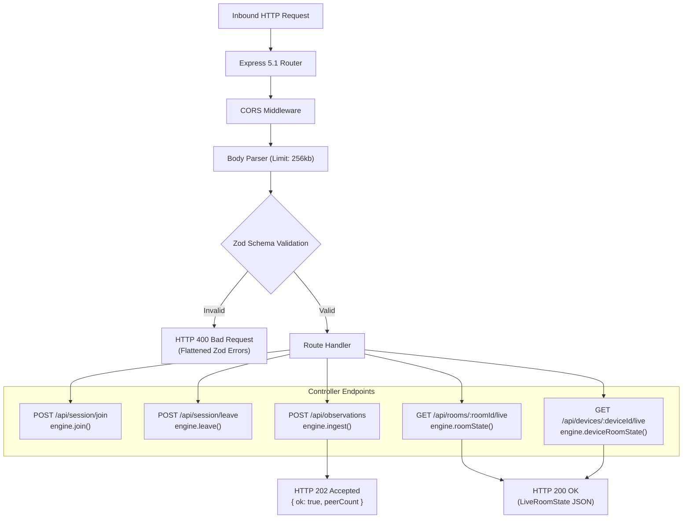

### 11.2 Verified REST API Summary Table

| Endpoint | HTTP Method | Purpose | Request Description | Response Description |
|---|---|---|---|---|
| `/health` | `GET` | Server liveness probe. | None | `{"ok": true}` |
| `/api/health` | `GET` | API route liveness probe. | None | `{"ok": true}` |
| `/api/session/join` | `POST` | Explicitly registers a device into an active session. | JSON: `sessionId`, `deviceId`, `displayName?`, `role` (`"presenter" \| "attendee"`), `roomId?`. | HTTP 201: `{"ok": true}` |
| `/api/session/leave` | `POST` | Deregisters a device and purges its active observation batches. | JSON: `deviceId`. | HTTP 200: `{"ok": true}` |
| `/api/observations` | `POST` | Ingests a 10-second batch of peer BLE and ambient Wi-Fi observations. | JSON: `PresenceBatch` (sessionId, deviceId, displayName?, rotatingId, role, roomId?, capturedAt, motionState?, peers $\le 100$, wifiFingerprint $\le 50$). | HTTP 202: `{"ok": true, "peerCount": N}` |
| `/api/rooms` | `GET` | Lists all active and default rooms for a session. | Query param: `sessionId` (default: `"poc-session"`). | HTTP 200: `{"rooms": ["room-a", "room-b", ...]}` |
| `/api/rooms/:roomId/live` | `GET` | Returns real-time presence cluster for a specific room. | Path param: `roomId`. Query: `sessionId`. | HTTP 200: `LiveRoomState` (presenter ID, estimated members, confidence, Wi-Fi similarity). |
| `/api/devices/:deviceId/live` | `GET` | Queries which active presenter's room cluster contains the given attendee device. | Path param: `deviceId`. Query: `sessionId`. | HTTP 200: `LiveRoomState` for the matched room, or `{ "roomId": "unknown", "members": [] }`. |

---

## 12. Presence Inference and Processing Architecture

The `PocInferenceEngine` (`inference.ts`) implements graph-theoretic spatial clustering.

### 12.1 Inference Processing Pipeline Diagram

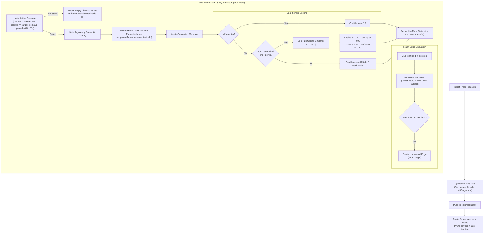

### 12.2 Inference Algorithms and Mathematical Rules

1. **Sliding Window Filtering (`trim()`):**
   - Active batch window: `WINDOW_MS = 30_000` (30 seconds). Batches older than 30s are shifted out of the array.
   - Stale device eviction: `staleDeviceCutoff = WINDOW_MS * 3` (90 seconds). Devices with no heartbeats for 90s are purged from memory.
2. **Robust Token-to-Device Resolution:**
   - **Direct Resolution:** Exact match in `tokenToDevice` hash map.
   - **Prefix/Suffix Fallback:** If a raw token was truncated during BLE packet slicing, extracts the first 4+ characters before the hyphen (`split("-")[0]`) and performs a substring/suffix search against registered device IDs.
3. **Graph Adjacency Edge Formation:**
   - For every peer observation in the active window:
     - Rejects signals where $\text{RSSI} < -85\text{ dBm}$.
     - Rejects self-sightings ($\text{peerDeviceId} == \text{batch.deviceId}$).
     - Creates an undirected edge $(u, v)$ in adjacency map `graph: Map<string, Set<string>>`.
4. **Presenter-Anchored Connected Component (BFS):**
   - Initializes a queue with `[presenter.deviceId]`.
   - Executes standard Breadth-First Search across graph $G$, visiting all direct and transitive peer nodes.
   - All visited nodes are labeled as members of the presenter's room.

---

## 13. End-to-End Data Flow

The following diagram traces the complete lifecycle of presence data from physical radio emission to UI presentation.

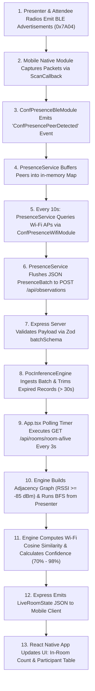

---

## 14. Data Architecture

### 14.1 Current POC Data Architecture
In the current implementation, **all data resides strictly in volatile memory**:
- **Mobile Tier:** Ephemeral state held in React component state (`App.tsx`) and JavaScript class instances (`PresenceService`, `activePeerCache`).
- **Backend Tier:** In-memory `Map<string, DeviceRecord>` and array `batches: PresenceBatch[]` inside the Node.js process heap.
- **Data Retention:** Observation batches expire after 30 seconds; device records expire after 90 seconds of inactivity.

```
Current In-Memory Schema (PocInferenceEngine):
┌────────────────────────────────────────────────────────────────────────┐
│ devices: Map<string, DeviceRecord>                                     │
│   ├── [deviceId]: {                                                    │
│   │     deviceId: string, displayName?: string, role: "presenter"|..., │
│   │     roomId?: string, rotatingId?: string, updatedAt: number,       │
│   │     wifiFingerprint?: [{ bssid, ssid, rssi, frequency }]           │
│   │   }                                                                │
└────────────────────────────────────────────────────────────────────────┘
┌────────────────────────────────────────────────────────────────────────┐
│ batches: Array<PresenceBatch>                                          │
│   ├── [0..N]: {                                                        │
│   │     sessionId, deviceId, rotatingId, role, capturedAt, peers: [],  │
│   │     wifiFingerprint: []                                            │
│   │   }                                                                │
└────────────────────────────────────────────────────────────────────────┘
```

### 14.2 Enterprise Target Recommendation (Proposed / Target State)
*Not currently implemented.* For enterprise scale, the volatile in-memory store must be replaced with a multi-tiered persistence and caching architecture:

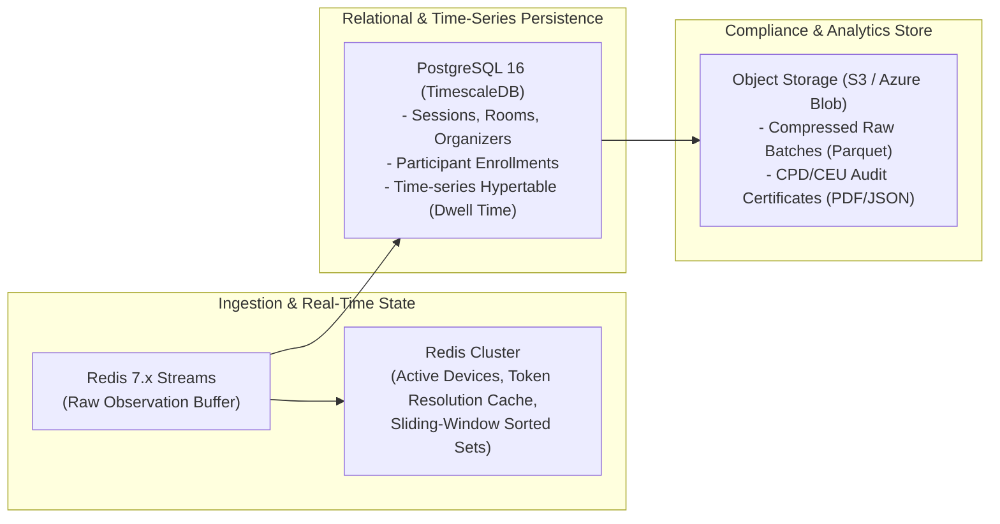

1. **Redis 7.x Cluster (In-Memory Real-Time State):**
   - *Purpose:* Low-latency ($\le 2\text{ms}$) storage for active device registries, token-to-device mapping tables, and sliding-window observation sorted sets (`ZADD` scored by epoch timestamp).
2. **PostgreSQL 16 + TimescaleDB (Persistent Relational Store):**
   - *Purpose:* Multi-tenant organizational data, venue maps, session schedules, user credentials, and time-series hypertables recording computed presence intervals for CPD/CEU compliance audits.
3. **Cloud Object Storage (AWS S3 / Azure Blob Storage):**
   - *Purpose:* Long-term archiving of raw observation telemetry in Apache Parquet format for ML analysis and tamper-proof PDF audit certificates.

---

## 15. Security and Privacy Architecture

### 15.1 Currently Implemented Security/Privacy Measures
- **Pseudonymous Device Identifiers:** The mobile client generates synthetic IDs (`android-xxx`) instead of harvesting hardware IMEI, Android ID, or advertising IDs.
- **No Bluetooth MAC Tracking:** The native BLE scanner parses custom payload bytes from `ScanRecord`; hardware Bluetooth MAC addresses are explicitly stripped and never transmitted.
- **Rotating Tokens:** Ephemeral 60-second rotating IDs prevent long-term tracking of devices by passive third-party BLE listeners.
- **No Audio/Microphone Collection:** Ultrasonic tracking is excluded from the POC to avoid microphone privacy concerns.
- **Zod Strict Input Validation:** Inbound HTTP JSON payloads are validated against rigid schemas, preventing prototype pollution and invalid payload crashes.

### 15.2 Enterprise Security Recommendations (Proposed / Target State)
*Not currently implemented.*

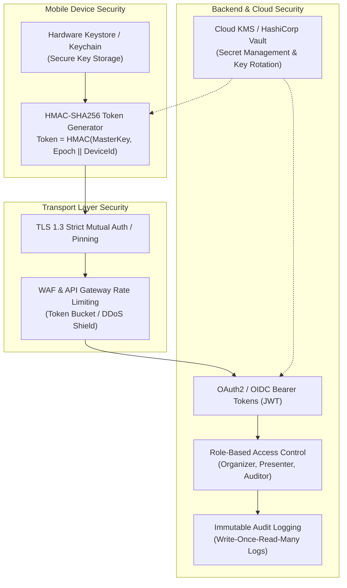

1. **Cryptographic HMAC Token Signing:** Derive rotating tokens using HMAC-SHA256 over `(SessionKey, Epoch, DeviceId)` so only the authorized backend can resolve tokens to users, preventing spoofing.
2. **TLS 1.3 & Certificate Pinning:** Enforce TLS 1.3 across all REST/WebSocket connections with mobile certificate pinning to block man-in-the-middle (MITM) proxies.
3. **Enterprise Authentication (OAuth2 / OIDC):** Integrate Azure AD, Okta, or Keycloak for organizer and presenter dashboard authentication.
4. **Data Minimization & Automated Retention Policies:** Automatically purge raw signal batches after 72 hours, persisting only cryptographically aggregated dwell-time records.

---

## 16. Deployment Architecture

### 16.1 Current POC Deployment Architecture
In the local development environment:
- The backend API runs locally on the engineer's workstation via Node.js / `tsx watch src/index.ts` bound to `0.0.0.0:3000`.
- Physical Android mobile devices connect over local Wi-Fi (LAN) to the host workstation's IP address (e.g., `http://192.168.0.195:3000`).
- A production `Dockerfile` (multi-stage Alpine Linux node build) and `render.yaml` specification are present for containerized deployment.

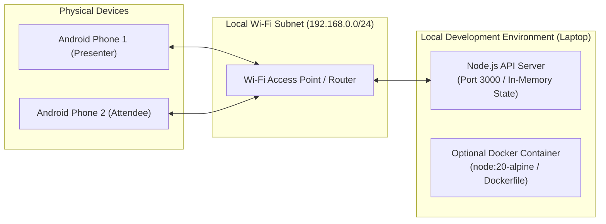

### 16.2 Proposed Enterprise Cloud Deployment Architecture
*Not currently implemented.*

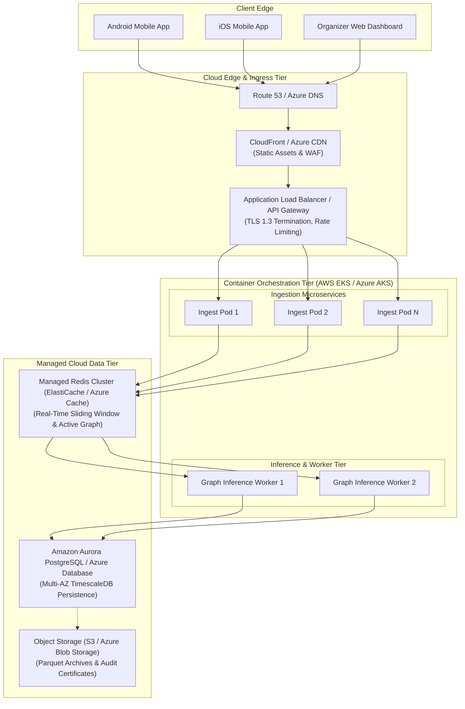

---

## 17. Scalability and Performance

### 17.1 Current Capability vs. Identified Bottlenecks

| Dimension | Current POC Capability | Enterprise Requirement | Bottleneck in Current Architecture |
|---|---|---|---|
| **Concurrent Mobile Clients** | $\sim 10 - 50$ devices | $5,000 - 50,000+$ devices | Node.js single-threaded heap memory; linear array scans in `trim()`. |
| **Observation Ingestion Rate**| $\sim 5 - 10$ req/sec | $500 - 5,000$ req/sec | Synchronous Express HTTP JSON parsing and in-memory batch pushing without a message broker. |
| **Graph Traversal Complexity**| Small BFS ($V \le 50$) | Partitioned Subgraphs ($V \ge 10,000$) | Reconstructing the entire adjacency graph on every HTTP query (`GET /live`) incurs $O(V + E)$ cost. |
| **Horizontal Scaling** | Single instance only | N horizontally scaled stateless pods | In-memory `devices` and `batches` maps prevent running multiple backend instances behind a load balancer. |

*Note: Formal load and benchmark testing has not yet been executed on the codebase.*

### 17.2 Enterprise Scalability Recommendations (Proposed / Target State)
1. **Decouple Ingestion from Inference:** Route inbound batches to an asynchronous message broker (Kafka or Redis Streams), allowing ingestion pods to acknowledge in $<10\text{ms}$.
2. **Pre-Computed Graph Projections:** Maintain dynamic graph edges inside Redis Graph or Redis Sorted Sets updated incrementally upon batch ingestion, eliminating on-demand full graph reconstruction.
3. **Partitioning by Session and Venue:** Shard message queues and cache keys by `sessionId` to ensure linear horizontal scaling across multi-hall conference centers.

---

## 18. Reliability and Fault Tolerance

### 18.1 Failure Modes and Mitigation Strategies

| Failure Scenario | Impact | Current POC Handling | Recommended Enterprise Mitigation |
|---|---|---|---|
| **Mobile Network Disconnect** | Batch upload fails temporarily. | **Graceful Catch:** `PresenceService.flushAndRotate()` swallows fetch exceptions, keeping BLE radio active. | **Local SQLite Queue:** Buffer batches in local SQLite; retry with exponential backoff on reconnection. |
| **Backend Server Crash / Restart** | Total loss of active session state. | **Volatile:** State is wiped; clients re-populate graph on subsequent 10s batches. | **Persistent Cache:** Redis Cluster with AOF persistence; continuous snapshotting to PostgreSQL. |
| **Duplicate / Out-of-Order Batches** | Potential skew in presence counts. | **Overwritten:** `devices.set()` updates latest timestamp; sliding window filters by `capturedAt`. | **Idempotency Keys:** Unique `batchId` UUIDs checked against Redis bloom filters. |
| **Android OS Background Doze** | BLE scanning interrupted. | **Foreground Only:** POC requires app to remain open. | **Foreground Service:** Sticky Android Foreground Service with continuous notification and partial wake lock. |
| **iOS Background Suspend** | Peripheral advertising halted by OS. | **Not Implemented on iOS.** | **APNs Silent Push Wake:** Scheduled push notifications waking app into short background execution windows. |

---

## 19. Observability and Operations

### 19.1 Current Observability Implementation
- **Logging:** Standard Node.js `console.log()` statements on API startup and basic error catching.
- **Health Checks:** Basic liveness endpoints `GET /health` and `GET /api/health` returning `{"ok": true}`.
- **Mobile Diagnostics:** On-screen diagnostic card (`App.tsx`) displaying current rotating token, visible Wi-Fi AP count, BLE peer count, and server connectivity badge.

### 19.2 Enterprise Observability Recommendations (Proposed / Target State)
*Not currently implemented.*
1. **Structured JSON Logging:** Implement Winston or Pino with standardized correlation IDs (`traceId`, `sessionId`, `deviceId`).
2. **Prometheus / OpenTelemetry Metrics:**
   - Ingestion throughput (`batches_ingested_total`, `peer_observations_rate`).
   - Inference latency (`graph_computation_duration_seconds`).
   - Active room member gauges (`room_occupancy_count{room="room-a"}`).
3. **Distributed Tracing:** OpenTelemetry instrumentation tracing requests from React Native client through API Gateway down to Redis and PostgreSQL.
4. **Alerting & Dashboards:** Grafana dashboards monitoring node memory, batch drop rates, and unassigned attendee percentages.

---

## 20. Technology Stack

### Detailed Technology Matrix (Current vs. Target)

| Layer | Technology | Version | Purpose | Current Status |
|---|---|---|---|---|
| **Language** | TypeScript | `^5.8.3` (API), `~5.9.2` (Mobile) | End-to-end type safety and contract enforcement. | **Currently Implemented** |
| **Language** | Kotlin | `1.9.x` / Android SDK | Native Android BLE and Wi-Fi system API access. | **Currently Implemented** |
| **Language** | Swift / Objective-C | Swift 5.x / iOS SDK | Native iOS CoreBluetooth and NetworkExtension bridge. | **Partially Implemented (Unverified Build)** |
| **Mobile Runtime** | React Native / Expo | RN `0.81.5`, Expo `^54.0.0` | Cross-platform mobile client application. | **Currently Implemented** |
| **Backend Runtime** | Node.js | `20+` | Server execution runtime. | **Currently Implemented** |
| **Backend Framework**| Express | `^5.1.0` | REST API routing and middleware. | **Currently Implemented** |
| **Validation** | Zod | `^3.24.4` | Inbound HTTP payload runtime schema validation. | **Currently Implemented** |
| **Package Manager** | pnpm Workspaces | `10.14.0` | Monorepo package management and linking. | **Currently Implemented** |
| **Containerization** | Docker | Alpine Linux `node:20-alpine` | Container packaging for API deployment. | **Currently Implemented** |
| **Real-Time State** | In-Memory Heap Maps | N/A (Node.js Heap) | POC sliding-window buffer and graph store. | **Currently Implemented (POC Only)** |
| **Distributed Cache**| Redis Cluster | `7.x` | Real-time state, sliding windows, token resolution. | **Proposed / Target State** |
| **Relational Database**| PostgreSQL + TimescaleDB| `16` | Persistent session, user, and attendance records. | **Proposed / Target State** |
| **Message Broker** | Kafka / Redis Streams | N/A | High-throughput asynchronous batch ingestion buffer. | **Proposed / Target State** |
| **Cloud Hosting** | AWS (EKS/ALB) / Azure | N/A | Cloud container orchestration and load balancing. | **Proposed / Target State** |

---

## 21. Architecture Decisions and Rationale

### Decision 1: React Native with Custom Native Modules
- **Rationale:** React Native enables 90%+ code sharing for UI, state management, and API networking, while custom native Kotlin/Swift modules provide direct, unconstrained access to OS-level Bluetooth and Wi-Fi APIs.
- **Alternatives Considered:** Pure native (separate Kotlin Android and Swift iOS apps) vs. Flutter vs. Expo Go.
- **Trade-offs:** Pure native requires maintaining two codebases; Flutter lacks mature low-level BLE background community bridges; Expo Go cannot execute custom native Bluetooth advertising.

### Decision 2: Zero-Hardware Anchor-Based Spatial Grounding
- **Rationale:** Utilizing the presenter's mobile phone as a room anchor eliminates venue beacon installation costs while establishing an authentic physical presence requirement.
- **Alternatives Considered:** Fixed BLE iBeacons, QR code wall posters, GPS geofencing.
- **Trade-offs:** If a presenter's phone battery dies or the presenter disables Bluetooth, the room loses its anchor until another host is designated.

### Decision 3: Dual-Sensor Fusion (BLE + Wi-Fi Cosine Similarity)
- **Rationale:** BLE provides high-frequency relative proximity, while multi-AP 5 GHz Wi-Fi vectors provide structural wall-attenuation filtering to prevent false cross-room proximity.
- **Alternatives Considered:** Pure BLE RSSI distance equations vs. Ultrasound acoustic gating.
- **Trade-offs:** iOS restricts ambient Wi-Fi scanning; requires fallback to BLE-only graph clustering on Apple devices.

### Decision 4: In-Memory Graph Clustering for POC Phase
- **Rationale:** Enabled rapid 4-day validation of mathematical clustering models without database schema migration overhead.
- **Alternatives Considered:** PostgreSQL graph extensions, Neo4j, RedisGraph.
- **Trade-offs:** Zero persistence across server restarts; limits horizontal scaling until distributed state management is introduced.

---

## 22. Current Limitations and Risks

| Risk / Limitation | Technical Impact | Current Status | Recommended Mitigation |
|---|---|---|---|
| **RSSI Signal Multipath & Jitter** | RF reflections cause fluctuating RSSI values ($\pm 10\text{ dBm}$). | **Present in POC** | Apply Kalman filtering / moving-average smoothing on mobile and server. |
| **Android Wi-Fi Scan Throttling** | Foreground apps limited to 4 scans per 2 minutes on Android 9+. | **Present in POC** | Throttled native scans to 30s intervals (`MIN_SCAN_INTERVAL_MS = 30_000L`). |
| **iOS Ambient Wi-Fi Inaccessibility**| iOS forbids unassociated BSSID scanning on non-MDM devices. | **Architectural Constraint**| Asymmetric sensor fusion: rely on BLE mesh + ultrasonic gating on iOS clients. |
| **Mobile OS Background Restrictions** | OS suspends BLE advertising when screen is locked. | **Present in POC** | Android Foreground Service + APNs/FCM silent push wake triggers. |
| **Server In-Memory Volatility** | Server restart purges active room state and active device records. | **Present in POC** | Transition to Redis Cluster and PostgreSQL persistence in Phase 3. |
| **Lack of API Authentication** | Endpoints accept unauthenticated batch submissions. | **Present in POC** | Implement OAuth2/JWT bearer authentication and HMAC batch signing. |

---

## 23. Gap Analysis: POC vs. Enterprise Architecture

| Architecture Area | Current POC Implementation | Enterprise Production Requirement | Identified Gap | Recommended Action |
|---|---|---|---|---|
| **Mobile OS Support** | Android verified with APK; iOS native code authored but unvalidated. | Full feature parity across Android and iOS in foreground & background. | iOS background BLE and Wi-Fi scanning restrictions. | Validate iOS build with EAS; implement asymmetric fusion and push wake. |
| **Data Persistence** | Volatile in-memory JavaScript Maps and arrays. | ACID-compliant relational & time-series database with backup. | 100% data loss on server restart; no historical audit trail. | Implement PostgreSQL 16 + TimescaleDB with automated backups. |
| **Scalability & State**| Single Node.js process; on-demand $O(V+E)$ graph BFS. | Stateless distributed microservices handling 10,000+ devices. | Cannot scale horizontally behind a load balancer. | Integrate Redis Cluster for sliding windows and Kafka for ingestion. |
| **Security & Auth** | Plaintext HTTP, unauthenticated endpoints, random string IDs. | TLS 1.3, OAuth2/OIDC JWT, HMAC token cryptographic signing. | Vulnerable to packet sniffing, device spoofing, and rogue batches. | Implement API Gateway authentication, TLS pinning, and HMAC signatures. |
| **Observability** | `console.log` and basic UI diagnostic cards. | Centralized logging, Prometheus metrics, distributed tracing. | Zero operational alerting, no visibility into server bottlenecks. | Deploy OpenTelemetry, Prometheus, Grafana, and structured Pino logs. |
| **CI / CD & Release** | Manual Gradle APK compilation (`assembleDebug`). | Automated multi-environment CI/CD pipelines with App Store release. | Manual build steps prone to human error. | Configure GitHub Actions for linting, testing, and EAS cloud builds. |

---

## 24. Recommended Target Enterprise Architecture
*(Proposed Target Architecture — Not Yet Implemented)*

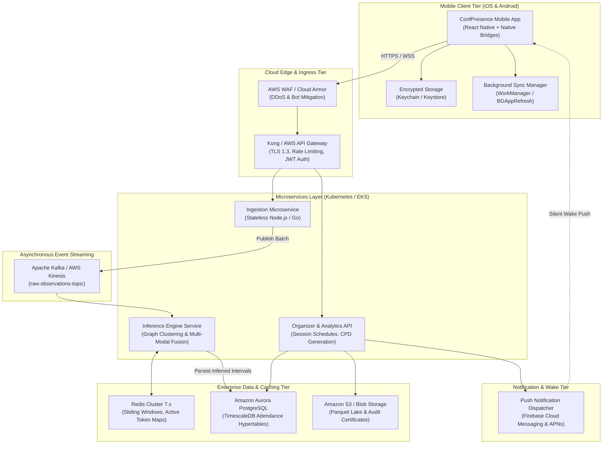

### Component Justification for Target Architecture:
1. **API Gateway (Kong / AWS API Gateway):** Offloads TLS termination, rate limiting, and JWT validation before requests reach backend compute.
2. **Kafka Event Streaming:** Buffers burst traffic during conference session start intervals, preventing database saturation.
3. **Redis Cluster:** Manages millisecond-speed graph sliding windows and token-to-device resolutions across stateless workers.
4. **TimescaleDB:** Handles high-volume time-series presence writes and computes continuous rollups for CPD dwell-time compliance.

---

## 25. Implementation Roadmap

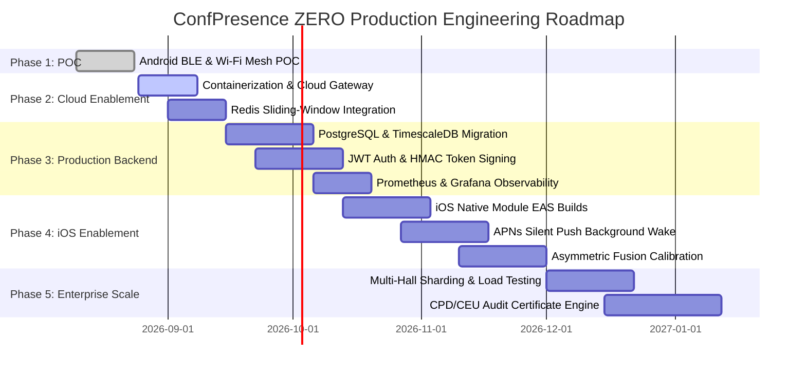

### Phase 1: Current POC Validation *(Completed)*
- Verified Android foreground BLE advertising and continuous scanning.
- Integrated ambient Wi-Fi AP fingerprinting and normalized cosine similarity.
- In-memory BFS graph clustering with presenter spatial anchoring.
- Diagnostic mobile UI with server discovery and live participant tables.

### Phase 2: Cloud Enablement & Distributed Caching *(Weeks 1–3)*
- Eliminate local IP dependency by deploying API to containerized cloud staging (AWS ECS / Render).
- Replace Node.js heap arrays with Redis 7.x Sorted Sets for sliding-window batch ingestion.
- Implement WebSocket or Server-Sent Events (SSE) for real-time mobile roster push updates.

### Phase 3: Production Backend Readiness & Security *(Weeks 4–7)*
- Integrate PostgreSQL 16 + TimescaleDB for persistent session records and dwell-time tracking.
- Implement OAuth2 / JWT authentication on API endpoints.
- Secure rotating tokens using HMAC-SHA256 derivation with session master keys.
- Deploy OpenTelemetry tracing, Prometheus metrics, and structured JSON logging.

### Phase 4: iOS Native Validation & Background Lifecycle *(Weeks 8–12)*
- Build and sign iOS development builds via Expo Application Services (EAS).
- Implement Apple Push Notification service (APNs) and Firebase Cloud Messaging (FCM) silent push triggers for background execution.
- Calibrate asymmetric sensor fusion algorithms for iOS devices lacking ambient Wi-Fi scanning.

### Phase 5: Enterprise Scaling & Compliance Audit Engine *(Weeks 13–16)*
- Execute distributed load testing simulating 10,000+ concurrent devices.
- Build automated CPD/CEU attendance compliance certificate generator.
- Implement multi-tenant organizational management and exportable venue heatmaps.

---

## 26. Assumptions and Open Questions

### Technical Assumptions
1. **Network Availability:** Mobile devices possess active cellular or venue Wi-Fi connectivity to reach the backend REST API.
2. **Presenter Participation:** Every tracked room has an enrolled presenter or session host device actively advertising as an anchor.

### Open Questions for Engineering Leadership & Stakeholders

> [!IMPORTANT]
> **Open Technical Decisions Requiring Stakeholder Input:**
> 1. **Target Cloud Platform:** Does the organization mandate AWS, Microsoft Azure, or Google Cloud Platform (GCP) for enterprise production hosting?
> 2. **Attendance Compliance Thresholds:** What minimum dwell time (e.g., 75% of total session duration) is legally required by accrediting bodies for CPD/CEU certification?
> 3. **Background Execution Policy:** Should the mobile application mandate an ongoing Android Foreground Notification, or rely strictly on periodic push-wake cycles?
> 4. **Enterprise Identity Provider:** Which identity provider (Azure AD / Entra ID, Okta, Ping Identity) will be used for conference organizers and attendee single sign-on (SSO)?
> 5. **Ultrasound Acoustic Gating:** Is there interest in evaluating near-field 18–20 kHz audio chirps in Phase 4 to guarantee physical boundary gating on iOS devices?

---

## 27. Conclusion

ConfPresence ZERO establishes a viable, mathematically grounded, zero-hardware paradigm for conference presence tracking. By transforming commodity smartphones into a collaborative sensing mesh, it eliminates the substantial hardware procurement and operational overhead of physical beacon deployments.

### Key Architecture Strengths
- **Dual-Sensor Fusion:** Overcomes RF wall-bleed by pairing low-latency BLE mesh peer discovery with structural Wi-Fi AP signature verification.
- **Privacy by Design:** Employs ephemeral pseudonyms and 60-second rotating tokens without harvesting Bluetooth MAC addresses, audio recordings, or GPS coordinates.
- **Clear Architectural Separation:** Strict monorepo modularity isolating native OS hardware drivers, shared DTO contracts, and backend graph traversal engines.

### Architectural Path Forward
The path from Proof of Concept to enterprise production requires executing the recommended cloud transition: replacing in-memory Node.js state with a distributed Redis/PostgreSQL persistence tier, securing the transport layer with TLS 1.3 and HMAC cryptographic token derivation, and validating the iOS native lifecycle through APNs silent push synchronization. This architecture provides a scalable, robust, and cost-effective foundation for enterprise-scale presence verification.
